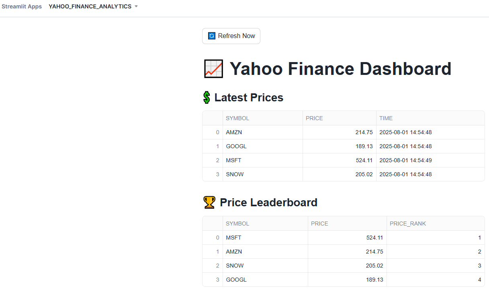
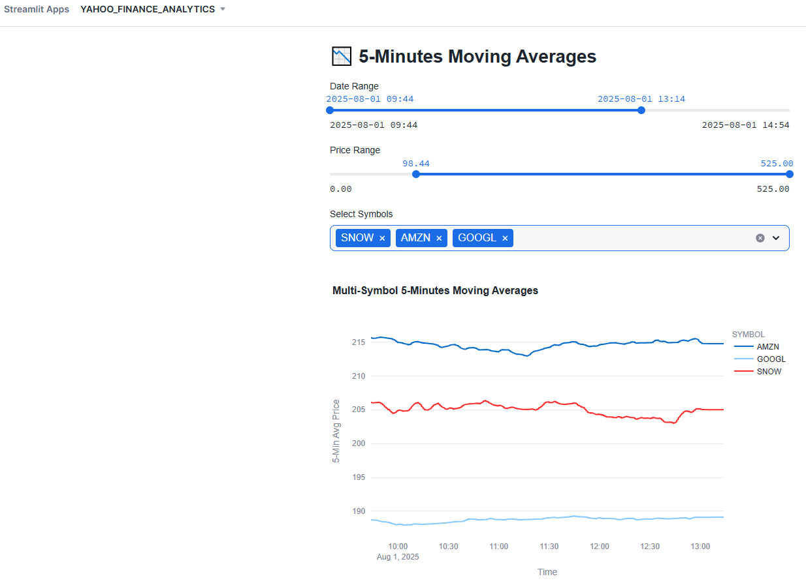
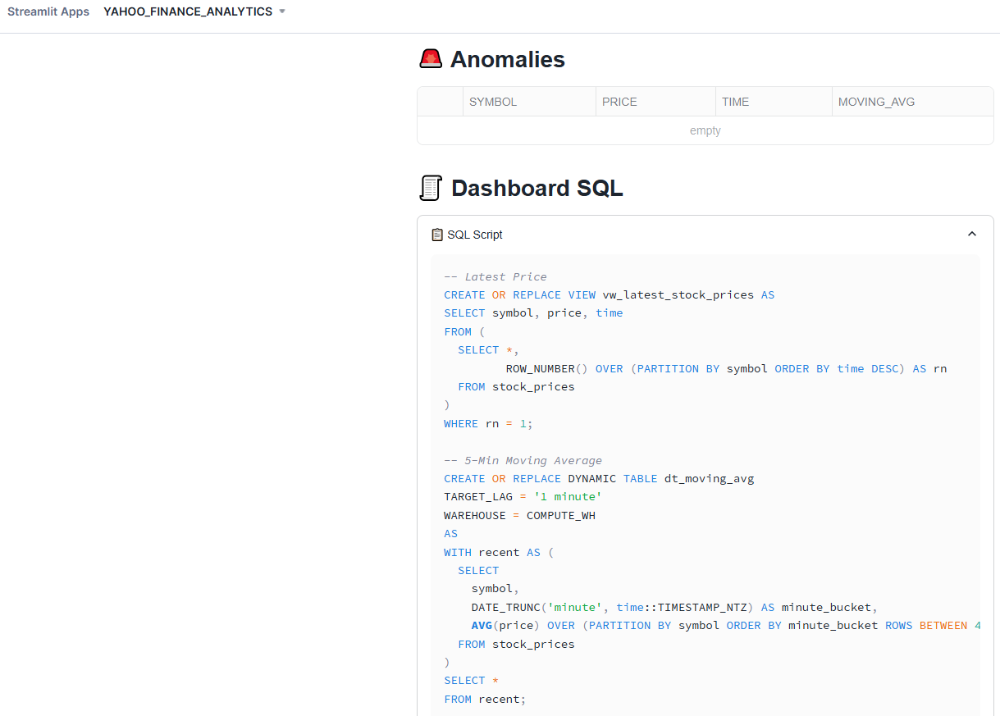

# 📈 Real-Time Stock Price ELT & Analytics Pipeline with Kafka, Snowflake & Streamlit

This project illustrates how to stream real-time stock price data from Yahoo Finance into Snowflake using Kafka and visualize it using a Snowflake-hosted Streamlit app.

---

## 🚀 Overview

- **Setup**: Setup Kafka and Snowflake Kafka Connector for real-time data streaming.
- **Ingest**: Publish live stock data from Yahoo Finance to a Kafka topic.
- **Load**: Stream the data into a Snowflake table using the Kafka Connector. Configure Snowflake Streams and Tasks for automated change detection in Kafka-Snowflake piped data and automated load in target table on a specific schedule (e.g, 1 minute).
- **Transform**: Real-time or near real-time analytics on stock prices using Snowflake views (e.g.latest prices, price leaderboard) and dynamic tables (e.g. 5-minute moving averages, anomaly detection).
- **Visualize**: Deliver live metrics in a Streamlit in Snowflake dashboard.

---

## 📒 Guide notebook

└── Real-time_Stock_Price_ELT_Analytics_Kafka_Snowflake_Streamlit.ipynb 

---

## 📂 Project Structure

<pre>
├── streamlit/
│ ├── streamlit_app.py # Streamlit dashboard code
│ ├── environment.yml 
│ ├── dashboard-images/ 
├── kafka/
│ └── kafka-producer.py # Kafka producer for Yahoo Finance data
├── snowflake/
│ ├── snowflake-kafka-connector-config.json # Configuration for Snowflake Kafka Connector
│ ├── snowflake-kafka-setup.sql # Create Snowflake database objects and role-based access control
│ ├── snowflake-analytics.sql # Create views and dynamic tables for analytics dashboard
├── images/ # dashboard screenshots
├── README.md
└── Real-time_Stock_Price_ELT_Analytics_Kafka_Snowflake_Streamlit.ipynb # Guide notebook
</pre>

---

## 📎 Sample Dashboard Screeshots

